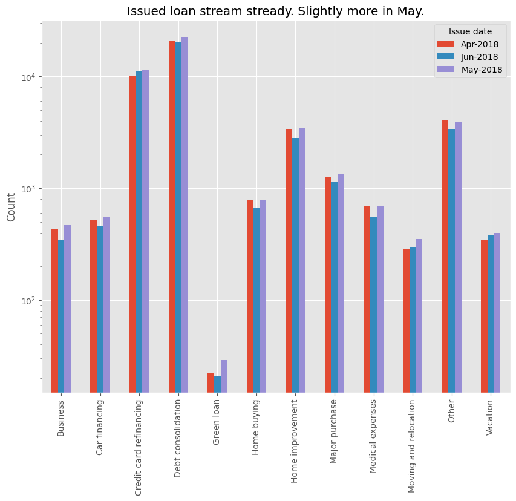
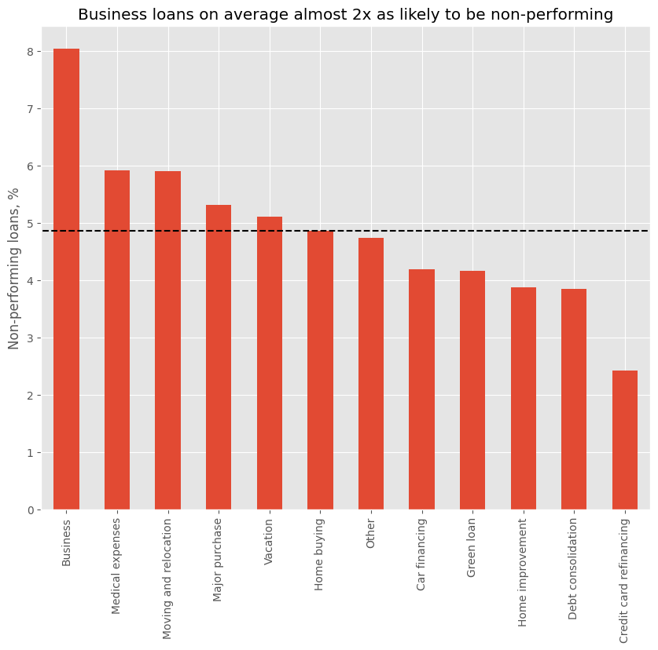
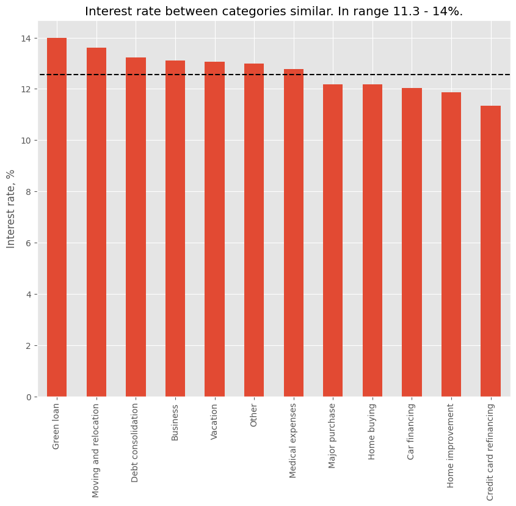
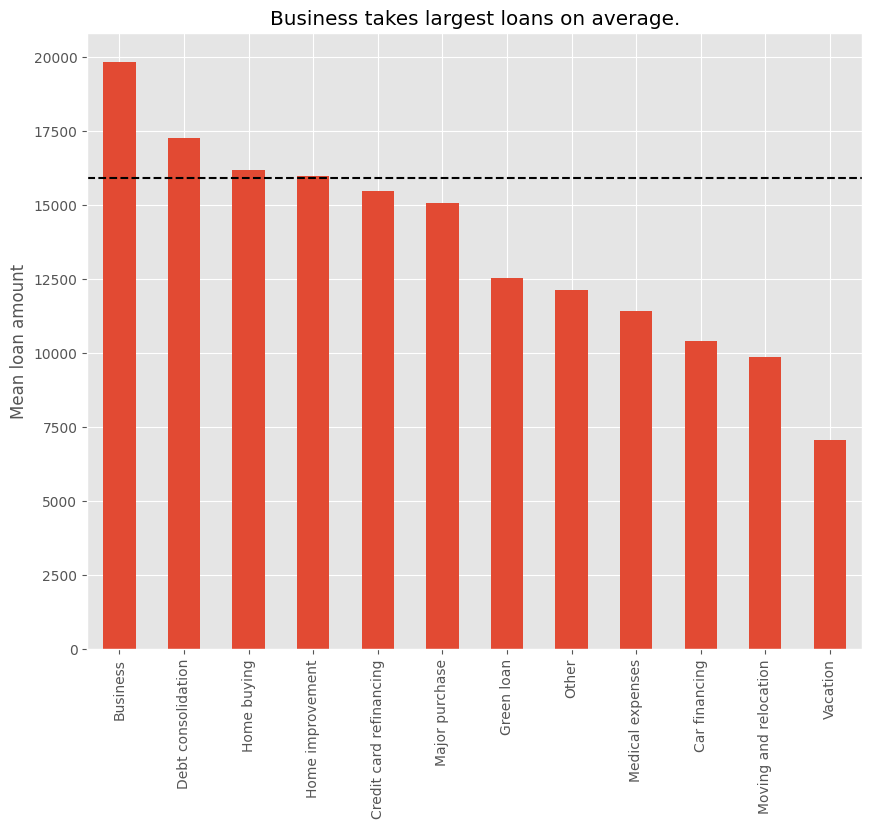
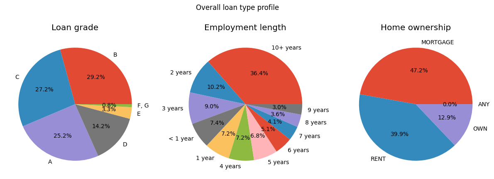
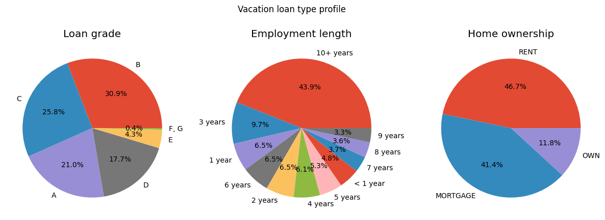
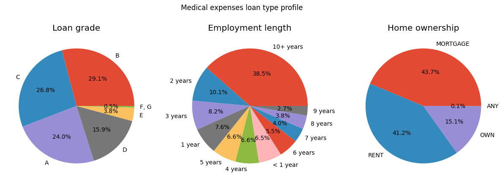
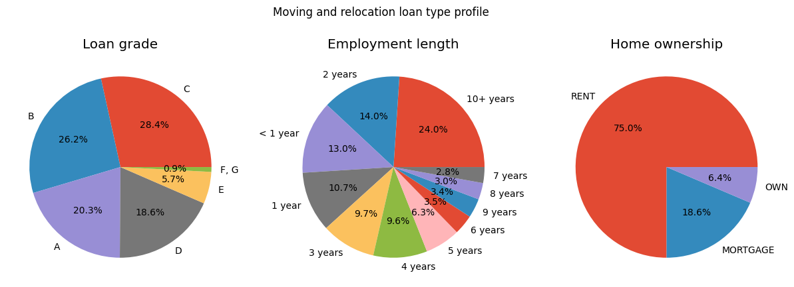

# Data Exploration

## How did the number of issued loans vary by month in Q2?

The stream of loans was comparable across all 3 months. May shows slightly higher numbers across almost all categories, but nothing out of the ordinary.

## Were there less performant categories than others?

Yes, *business* loans from Q2 2018 are almost 2x as likely to be non-performing as the other category average and more than 3x likely than the best performing *credit card refinancing* loans. Two other below average performing loans (*medical expenses* and *moving and relocation*) could be described as stressful and mostly unpleasant life events. The two best-performing categories (*credit card refinancing* and *debt consolidation*) are also the two most frequent categories for which loans have been issued. That's nice.

## Why were business loans less performant?

I checked if business loans have a higher than average interest rate. My speculation was that people fail to pay business loans because the interest is too high. However, the bar chart below shows otherwise. The interest rate between categories is quite similar and *debt consolidation* loans with a slightly higher mean interest rate are performing much better. I didn't investigate this question further, but overall business loans seem to be riskier.

## Why issue business loans?

It's a natural question to ask when this type of loans performs on average worse. However, it is also on average the largest loan, meaning more money earned in interest. Seems like *business* loans are higher risk - higher reward type of loans.

## How do some below average loan profiles compare to the average?

I chose 3 below average performing loan categories (*vacation*, *medical expenses*, *moving and relocation*) and explored these further.
This is by no means a complete analysis, but it does highlight some of the differences between these categories. Conclusions highly speculative!

Compared to the average profile, people who take loans for a vacation have been employed for longer, yet are more likely to rent a home. People who have an established career but value flexibility and freedom, and prefer to make their vacations count!

The medical expenses profile quite closely matches the average.

People who borrow money for moving or relocation purposes are overwhelmingly more likely to rent a home. They are also more often than average in their early career. This could mean that a significant portion of people who take these types of loans are in their early career and are relocating as part of their first job. This could partially explain their below average loan score - they haven't had the time to build up a better score.

Lastly, let's look at the TOP 5 employment titles per chosen loan type categories.

Note that it's not clear what *rn* stands for, but it could be the same as registered nurse.

| **Rank**   | **Overall**      | **Vacation**     | **Medical** | **Moving & Relocation** |
|------------|------------------|------------------|-------------|-------------------------|
| 1          | teacher          | manager          | teacher     | teacher                 |
| 2          | owner            | teacher          | owner       | manager                 |
| 3          | manager          | driver           | manager     | registered nurse        |
| 4          | driver           | registered nurse | driver      | general manager         |
| 5          | registered nurse | owner            | rn          | rn                      |

- Overall, the titles don't change that much between categories but the order does.
- Managers are more likely to take a vacation loan compared to other professions.
- Drivers are less popular in the *moving & relocation* category.

