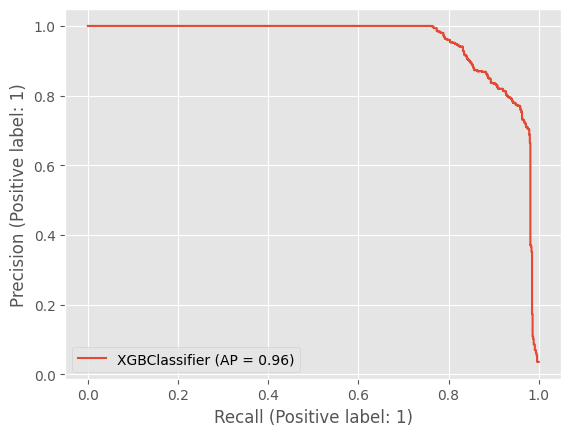
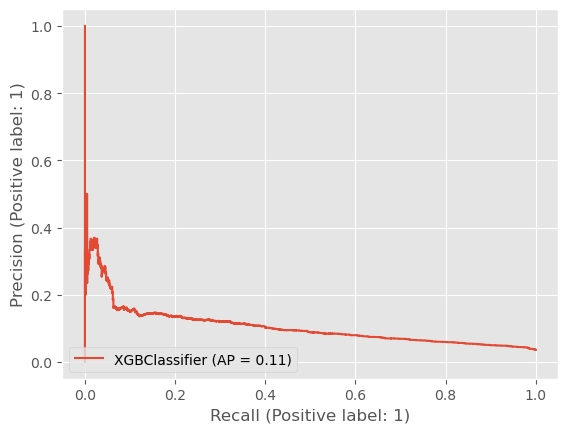

## Identifying relevant features

It's quite tricky to identify single features that relate to non-performing loans because most of the loans are still active. Higher interest rates, worse loan grades, and a history of delinquency or charging-off were correlated to non-performing loans, but no single feature stood out to me. In this case it is easier to try and identify features that are NOT relevant for predicting loan performance. The rest can be figured out by the model.

Firstly, there were 3 features that contained no values and these were automatically removed

Secondly, it was decided to remove joint applications as well as applications with a hardship status. Both of them introduce features that are applicable only to a subset of applications. While applications with a hardship status (<15) were considered as outliers and discarded, the joint applications can be modeled separately. To me this makes a bit more sense.

Thirdly, features that are only relevant when a loan is already non-performing were removed. Examples of these are settlement-related features, *collection_recovery_fee*, or *recoveries*.

Additionally, a set of features exist that don't really provide any relevant information about the borrower:

- **title**: While in itself is a useful feature, it's basically a copy of **purpose**.
- **pymnt_plan**: Almost all values are the same.
- **payment_plan_start_date**: Almost all values are missing.
- **funded_amnt**: All loans are funded so this feature is the same as **loan_amnt**.
- **funded_amnt_inv**: Investor related features not relevant.
- **out_prncp_inv**: Investor related features not relevant.
- **total_pymnt_inv**: Investor related features not relevant.
- **id**: Not even a proper feature.
- **member_id**: Same as ID.
- **next_pymnt_d**: Most values the same and I don't think this is relevant.
- **disbursement_method**: I don't think this is relevant.
- **issue_d**: I Don't expect any temporal correlation within just one quarter of a single year.

Lastly, some features could be useful but were removed for other reasons:

- **emp_title**,  # Extremely messy, too many categories.
- **zip_code**,  # Too many categories.
- **addr_state**,  # Too many categories.

## Building the model

Although there is a significant difference between being late on a payment for less than a month and charging-off, the loan status was reduced to a binary classification problem. Furthermore, because the feature that we are trying to predict is very unevenly distributed, or in other words, because majority of loans are performing, a typical classification metric such as accuracy is not particularly useful. Instead, I am focusing on recall (true positives) / (all predicted positives) and precision (true positives) / (true positives + false positives). In all cases I used either a Random Forest classifier or a gradient-boosted Random Forest classifier and evaluated each model on stratified 5-fold train/validation sets to avoid overfitting. For the gradient-boosted model I also setup early stopping as an additional overfitting counter-measure. With more time I would have experimented with other models.

The initial model in `model.ipynb` focused more on building re-usable functions and getting something to work. If it wasn't clear if a feature is useful or it was difficult to deal with, it was simply dropped. This initial model's performance was not that great but along the way I learned more about all the available features and for the second iteration devised the feature selection described in the previous section. Everything else was conveniently re-used and the second model's performance was pretty good. Below is the Precision-Recall curve for one of the 5 folds for the best-performing second iteration model.

After investigating the feature importances of the trained models, several leaking features were identified. After removing them, the model performance dropped tremendously.

